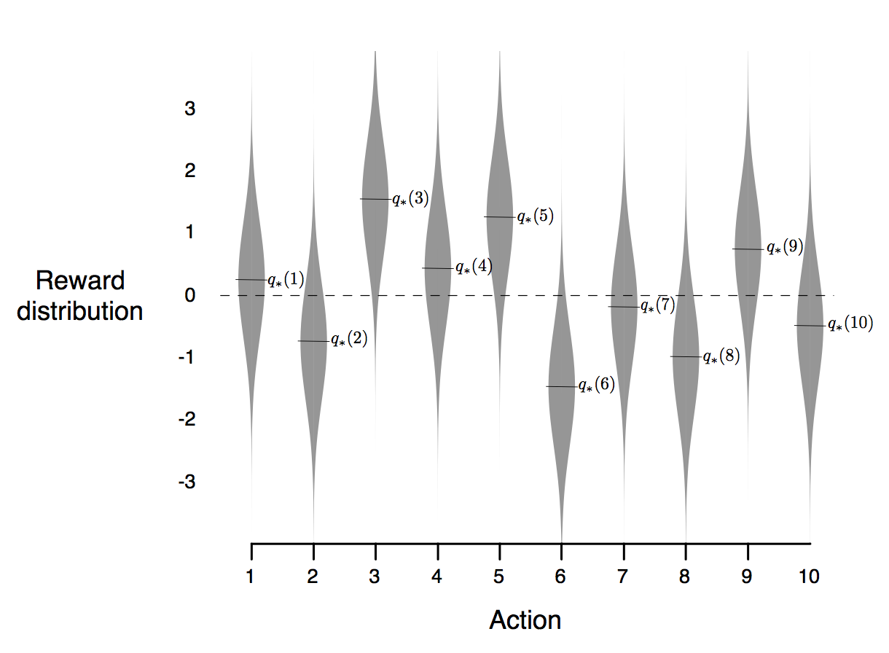
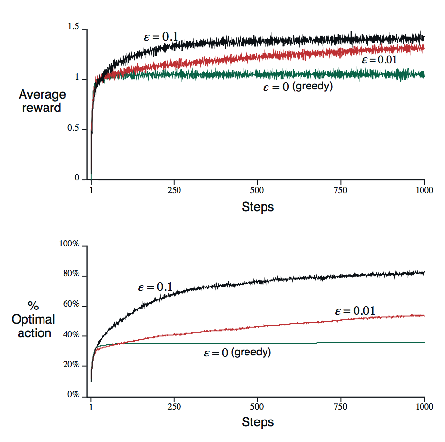

#2 장 멀티 암 밴딧

강화 학습을 다른 유형의 학습과 구별하는 가장 중요한 특징은 올바른 행동을 제공함으로써 지시하기보다는 취한 행동을 평가하는 훈련 정보를 사용합니다는 것입니다. 이것은 좋은 행동에 대한 명백한 시행 착오 탐색을 위해 능동적 인 탐구의 필요성을 창출하는 것입니다. 순전히 평가 피드백은 취해진 조치가 얼마나 좋은지를 나타내지 만 가능한 최선의 행동인지 최악의 행동인지를 나타냅니다. 반면에 실제로 유익한 피드백은 실제로 취해진 조치와 독립적으로 취할 올바른 조치를 나타냅니다. 이러한 종류의 피드백은 패턴 분류의 큰 부분, 인공 신경망 및 시스템 식별을 포함하는 감독 학습의 기본입니다. 그들의 순수한 형태에서,이 두 종류의 피드백은 아주 분명합니다. 평가 피드백은 취해진 행동에 전적으로 의존하는 반면, 교훈적인 피드백은 취해진 행동과 독립적입니다. 또한 평가와 수업이 함께 혼합되는 흥미로운 중간 사례가 있습니다.

이 장에서는 한 가지 이상의 상황에서 학습하는 것을 포함하지 않는 단순한 환경에서 강화 학습의 평가 측면을 연구합니다. 이 비 연관성 설정은 평가 피드백과 관련된 대부분의 이전 작업이 완료되어 전체 강화학습 문제의 복잡성을 상당 부분 피할 수있는 환경입니다. 이 사례를 연구하면 평가 피드백이 평가 피드백과 다른 점을 명확하게 볼 수있을뿐 아니라 교훈 피드백과 결합 할 수 있습니다.

우리가 탐구하는 특별한 비논리적이고 평가적인 피드백 문제는 k-armed bandit 문제의 단순한 버전입니다. 우리는이 문제를 사용하여 이후의 장에서 확장 된 많은 기본 학습 방법을 소개하여 전체 강화학습 문제에 적용합니다. 이 장의 끝에서, 우리는 적기가 문제가 연관되어있을 때, 즉 하나 이상의 상황에서 행동이 취해질 때 일어나는 일을 토의함으로써 전체 강화학습 문제에 한발 더 다 가설 것입니다.

##2.1 k-armed bandit 문제

다음 학습 문제를 생각해보겠습니다. 당신은 반복적으로 k 개의 다른 옵션 또는 동작 중에서 하나를 선택해야합니다. 각 선택 후에 당신이 선택한 행동에 의존하는 고정 된 확률 분포로부터 선택된 수치 보상을 받게됩니다. 당신의 목표는 1000 가지 이상의 행동 선택이나 시간 단계와 같이 일정 기간 동안 예상되는 총 보상을 최대화하는 것입니다.

이것은 k-armed bandit 문제의 원래 형태입니다. 슬롯 머신이나 "one-armed bandit"에 비유하여 이름을 딴 것입니다. 단 하나가 아닌 k 개의 레버를 가지고 있습니다. 각 액션 선택은 슬롯 머신의 레버 중 하나의 플레이와 같으며 보상은 잭팟을 치는 데 대한 결과입니다. 반복적 인 액션 선택을 통해 최고의 레버에 자신의 행동을 집중시켜 상금을 최대화해야합니다. 또 다른 비유는 일련의 중증 환자에 대한 실험적 치료법을 선택하는 의사의 유추입니다. 각 행동 선택은 치료 선택이며, 각 보상은 환자의 생존 또는 복지입니다. 오늘날 "적기 문제"라는 용어는 위에 설명 된 문제의 일반화를 위해 사용되기도하지만,이 책에서는이 단순한 경우를 나타 내기 위해 이 책을 사용합니다.

우리의 k-armed bandit 문제에서 각 k 행동은 그 행동이 선택되었습니다는 것을 감안할 때 예상 또는 평균 보상을 갖는다. 이것을 우리가 그 행동의 가치라고 부르 자. 우리는 시간 단계 t에서 선택된 행동을 At로, 상응하는 보상을 Rt로 나타냅니다. q \* \(a\)로 표시된 임의의 행동 a의 값은 a가 주어 졌을 때 기대되는 보상입니다 :

q \* \(a\) = E \[Rt \| At = a\].

각 행동의 가치를 안다면 k-armed bandit의 문제를 해결하는 것이 쉽습니다. 항상 가장 높은 가치의 행동을 선택하게됩니다. 견적을 가지고 있더라도 확실하게 조치 값을 알 수 없다고 가정합니다. 우리는 시간 t에서의 행동 a의 추정 된 값을 $ Q_t(a) ≈ q*(a) $로 나타냅니다.

조치 값의 추정값을 유지 보수하는 경우, 시간 단계마다 예상 값이 가장 큰 조치가 하나 이상 있습니다. 우리는 이것을 욕심 많은 행동이라고 부릅니다. 이러한 작업 중 하나를 선택하면 해당 작업의 가치에 대한 현재 지식을 활용하고 있다고합니다. 비협조적인 행동 중 하나를 선택하면 비 활동 행동의 가치에 대한 견적을 향상시킬 수 있기 때문에 탐험합니다고 말합니다. 착취는 한 단계에서 기대되는 보상을 극대화하기위한 옳은 일이지만 탐사는 장기적으로 더 많은 총 보상을 생산할 수 있습니다. 예를 들어, 탐욕스러운 행동의 가치가 확실하게 알려져 있다고 가정 할 때, 몇 가지 다른 행동은 거의 비슷하지만 상당한 불확실성이있는 것으로 평가된다고 가정 해보십시오. 불확실성은 이러한 다른 행동 중 적어도 하나가 실제로 욕심 많은 행동보다 실제로 더 나을 것이지만 어느 것을 알지는 못합니다. 행동 선택을 할 시간이 많이 있다면, 비 활동 행동을 탐구하고 탐욕스러운 행동보다 더 나은 행동을 발견하는 것이 낫습니다. 보상은 단기간에 탐사 중에는 낮지 만 더 나은 행동을 발견 한 후에는 여러 번 악용 할 수 있기 때문에 장기적으로는 높습니다. 탐험하기가 불가능하기 때문에 더 나은 행동을 발견 한 후에 여러 번 악용 할 수 있기 때문에 장기적으로는 더 높습니다. 탐험하기가 불가능하기 때문에 더 나은 행동을 발견 한 후에 여러 번 악용 할 수 있기 때문에 장기적으로는 더 높습니다. 탐험하기가 불가능하기 때문에 어떤 단일 액션 선택으로도 악용하기 위해서는 탐사와 착취 사이 의 "갈등"을 종종 언급합니다.

특정 사례의 경우 탐색이나 악용이 더 나은지 여부는 추정치, 불확실성 및 남은 단계 수의 정확한 값에 따라 달라집니다. k- 무장 한 산적의 특정 수학 공식 및 관련 문제에 대한 탐사와 착취의 균형을 유지하기위한 정교한 방법이 많이 있습니다. 그러나 이러한 방법의 대부분은 응용 프로그램에서 검증 할 수 없거나 검증 할 수없는 안정도와 사전 지식에 대한 강한 가정을하고 이후 장에서 우리가 고려하는 전체 강화 학습 문제에 대해 강력하게 가정합니다. 이러한 방법에 대한 최적 또는 제한적 손실의 보장은 이론의 가정이 적용되지 않을 때 거의 안락합니다.

이 책에서 우리는 정교한 방법으로 탐색과 착취의 균형을 유지하는 것에 대해 걱정하지 않습니다. 우리는 그것들을 전혀 균형을 유지하는 것에 대해서만 걱정합니다. 이 장에서는 k- 무장 한 적기에 대한 몇 가지 간단한 밸런싱 방법을 제시하고 항상 악용하는 방법보다 훨씬 잘 작동하는 것을 보여줍니다. 탐사와 착취의 균형을 맞출 필요는 강화 학습에서 발생하는 특유의 도전입니다. K- 무장 한 적기에 대한 문제의 단순성으로 우리는이를 명확한 형태로 보여줄 수있다.

## 2.2 행동 가치 방법

우리는 행동의 가치를 평가하고 행동 선택 결정을 내리기 위해 추정치를 사용하는 몇 가지 간단한 방법을 더 자세히 살펴 본다. 행동의 진정한 가치는 그 행동이 선택되었을 때의 평균 보상이라는 점을 상기하십시오. 이것을 추정하는 자연스러운 방법은 실제로받은 보상을 평균하는 것입니다. 

$$ Q_t(a) = \frac{t 이전에 받은 보상의 합\ \ \ \ \ \ \ \ \ \ \ \ \ \ }{t 이전에 지나간 시간의 수\ \ \ \ \ \ \ \ \ \ \ \ \ \ } = \frac{\sum_{n=1}^{t-1} R_i\cdot1_{A_i=a}}{\sum_{n=1}^{t-1} 1_{A_i=a}} = 1 $$

    
여기서 $1_{predicate}$는 술어가 참이면 1이고 그렇지 않으면 0 인 확률 변수를 나타냅니다. 분모가 0이면 $Q_1(a) = 0$과 같은 어떤 기본값으로 $Q_t(a)$를 정의합니다. 분모가 무한대로 갈수록 많은 수의 법칙에 의해 $ Q_t(a)=q_*(a) $. 각 추정치는 관련 보상의 표본의 평균이기 때문에이 값을 표본 평균 방법이라고합니다. 물론 이는 행동 값을 추정하는 한 가지 방법 일뿐, 반드시 가장 좋은 것은 아닙니다. 그럼에도 불구하고, 지금 우리는이 간단한 추정 방법을 유지하고 추정값을 사용하여 동작을 선택하는 방법에 대한 질문으로 돌아가 보겠습니다.

가장 단순한 행동 선택 규칙은 가장 높은 예상 행동 값을 갖는 행동 (또는 하나의 행동)을 선택하는 것입니다. 즉 욕심 많은 행동 중 하나를 선택하는 것입니다. $A^*_t, Q_t(A^*_t) = max_a Q_t(a)$. 이 탐욕스러운 행동 선택 방법은 아래와 같이 쓸 수 있습니다 . 

$$A_t = \underset{a}{\mathrm{argmax}} Q_t (a) \\$$

여기서 argmax(a)는 다음식이 최대로되는 값 \(임의로 부수적으로 묶음\)을 나타냅니다. 탐욕스러운 행동 선택은 항상 즉각적인 보상을 최대화하기 위해 현재의 지식을 활용합니다. 그보다 더 열악한 행위를 샘플링 할 때 시간을 들여서 실제로 더 나아 졌는지를 알지 못합니다. 간단한 대안은 대부분의 시간을 탐욕스럽게 행동하는 것입니다. 그러나 때때로 작은 확률 ε을 사용하여 행동 가치 평가와는 별개로 모든 확률로 임의의 확률로 무작위로 선택하는 것이 좋습니다. 우리는이 욕심 많은 행동 선택 규칙 ε-greedy methods를 사용하여 메소드를 호출합니다. 이 방법의 장점은 단계 수가 증가함에 따라 모든 동작이 무한 횟수 샘플링되므로 모든 $Q_t(a)$가 $q_*(a)$로 수렴된다는 것입니다. 이것은 물론 최적의 작용을 선택하는 확률이 1 - ε보다 큰 값, 즉 거의 확실하게 수렴합니다는 것을 의미합니다. 그러나 이것은 단지 점근 적 보장이며, 방법의 실질적인 효과에 대해서는 거의 말하지 않습니다.

   
탐욕스럽고 탐욕스러운 방법의 상대적인 효과를 대략적으로 평가하기 위해 일련의 테스트 문제에서 수치를 비교했습니다. 이것은 k = 10 인 무작위로 생성 된 k-armed bandit의 2000 개 세트의 집합입니다. 그림 2.1과 같은 각 적기의 문제에 대해 동작 값 $q_*(a), a = 1 ,. . . , 10$은 평균 0과 분산 1을 갖는 정규 (가우시안) 분포에 따라 선택되었습니다. 그런 다음, 그 문제에 적용된 학습 방법이 시간 t에서 동작을 선택했을 때,

그림 2.1 : 10-armed bandit의 예시 적기. 10 개의 행동 각각의 진정한 가치 $q_*(a)$는 단위 분산으로 0을 중심으로하는 정규 분포에 따라 선택되었고, 실제 보상은 단위 분산으로 $q_*(a)$ 주위에서 선택되었습니다.

   
실제 보상 Rt는 평균 $q_*(A_t)$와 분산 1을 갖는 정규 분포로부터 선택되었습니다. 그림 2.1에서 회색으로 표시된 분포입니다. 우리는이 테스트 작업 세트를 10-armed testbed라고 부릅니다. 어떤 학습 방법에 대해서도 우리는 적기의 문제 중 하나와 상호 작용하는 1000 단계 이상의 경험으로 향상되어 그 성능과 행동을 측정 할 수 있습니다. 이것은 하나의 실행을 구성합니다. 다른 적기의 문제로 2000 번의 독립 실행을 반복하면서, 우리는 학습 알고리즘의 평균 행동 측정을 얻었습니다.

그림 2.2는 위에서 설명한 바와 같이 10-armed testbed에서 두 가지 ε-greedy 방법 \(ε = 0.01 및 ε = 0.1\)이있는 greedy 메소드를 비교합니다. 두 방법 모두 표본 평균 기법을 사용하여 행동 가치 추정치를 만들었습니다. 위 그래프는 경험에 따른 예상 보상의 증가를 보여줍니다. 욕심 많은 방법은 처음에는 다른 방법보다 약간 빠르게 향상되었지만 낮은 수준에서는 평평 해졌습니다. 이 테스트 베드에서 약 1.55의 최상의 결과와 비교했을 때, 1 단계 당 보상 만 달성했습니다. 욕심 많은 방법은 종종 차선책을 수행하지 못하기 때문에 장기적으로 심각하게 악화됩니다. 아래 그래프는 욕심 많은 방법이 작업의 약 1/3에서만 최적의 동작을 발견했음을 보여줍니다. 다른 2/3에서는, 최적 동작의 초기 샘플이 실망스러웠습니다. 그리고 결코 돌아 오지 않았습니다. ε- 욕심 많은 방법은 결국 탐구하고 개선하기 때문에 더 잘 수행됩니다.

    

그림 2.2 : 10- 무장 테스트 베드에서의 ε- 욕심 많은 행동 가치 방법의 평균 수행. 이 데이터는 다른 적기 ​​문제가있는 2000 회 이상의 평균입니다. 모든 방법은 표본 평균을 그들의 행동 가치 추정치로 사용했다.

최적의 행동을 인식 할 수있는 기회. ε = 0.1 방법은 더 많은 것을 탐구하고, 보통 최적의 동작을 일찌감치 발견하지만, 91 % 이상의 시간을 선택하지는 않습니다. ε = 0.01 방법은 더 천천히 향상되지만 결국 두 성능 측정 모두에서 ε = 0.1 방법보다 성능이 우수합니다. 높은 값과 낮은 값을 모두 얻을 수 있도록 시간에 따라 ε을 줄이는 것도 가능합니다.

greedy 방식보다 ε-greedy의 이점은 작업에 따라 다릅니다. 예를 들어 보상 분산이 1보다 커지면 10이된다고 가정 해보십시오. 잡음이 많은 보상을 사용하면 최적의 동작을 찾기 위해 더 많은 탐색이 필요하며 욕심 많은 방법과 비교해 ε- 탐욕적인 방법이 더 나은 결과를 가져야합니다. 반면에, 보상 차이가 0이라면, 욕심 많은 방법은 한 번 시도한 후에 각 조치의 실제 가치를 알 수 있습니다. 이 경우 욕심 많은 방법은 실제로 최적의 동작을 찾은 다음 절대로 탐색하지 않기 때문에 실제로 가장 잘 수행 될 수 있습니다. 그러나 결정론적인 경우조차도, 우리가 다른 가정들을 약화 시킨다면 탐구하는데 큰 이점이있다. 예를 들어, 적기 태스크가 비정규 적이라고 가정하자. 즉, 시간이 지남에 따라 액션의 실제 값이 변경되었습니다고 가정하자. 이 경우 탐구는 결정 론적 사건에서도 비협조적인 행동 중 하나가 탐욕스러운 행동보다 나아지지 않도록 변경되지 않았 음을 확인하는 데 필요합니다. 다음 몇 장에서 볼 수 있듯이, 강화 된 비 안정도는 강화학습에서 가장 흔하게 발생합니다. 기본 작업이 고정적이고 결정 론적이라 할지라도 학습자는 학습 진행과 에이전트의 정책 변경에 따라 시간이 지남에 따라 각각 변화하는 적기의 결정 작업 집합에 직면합니다. 강화 학습은 탐사와 착취 사이의 균형을 필요로합니다. 기본 작업이 고정적이고 결정 론적이라 할지라도 학습자는 학습 진행과 에이전트의 정책 변경에 따라 시간이 지남에 따라 각각 변화하는 적기의 결정 작업 집합에 직면합니다. 강화 학습은 탐사와 착취 사이의 균형을 필요로합니다. 기본 작업이 고정적이고 결정 론적이라 할지라도 학습자는 학습 진행과 에이전트의 정책 변경에 따라 시간이 지남에 따라 각각 변화하는 적기의 결정 작업 집합에 직면합니다. 강화 학습은 탐사와 착취 사이의 균형을 필요로합니다.

연습 2.1 그림 2.2의 비교에서 누적 보상과 최상의 행동을 선택하는 누적 확률의 관점에서 장기적으로 가장 좋은 결과를 얻을 수있는 방법은 무엇입니까? 얼마나 더 좋을까요? 대답을 정량적으로 표현하십시오.

##2.3 점진적 구현 (Incremental Implementation)

지금까지 논의한 행동 가치 방법은 관찰 된 보상의 표본 평균으로 행동 가치를 추정합니다. 우리는 이러한 평균이 계산 상 효율적으로, 특히 일정 메모리 및 시간 단계 계산을 통해 어떻게 계산 될 수 있는지에 대한 질문을 던집니다.

표기법을 간소화하기 위해 우리는 하나의 행동에만 집중합니다. Ri는 이제이 동작의 i 번째 선택 이후에 수신 된 보상을 표시하고, n - 1 번을 선택한 후에 Qn을 해당 동작 값의 추정치로 표시하게합니다. 이제 간단히

$$Q_n=\frac{R_1+R_2+\cdots+R_{n-1}}{n-1}$$

명백한 구현은 모든 보상의 기록을 유지하고 추정값이 필요할 때마다 이러한 연산을 수행하는 것입니다. 그러나이 경우 메모리 및 계산 요구 사항은 더 많은 보상이 표시됨에 따라 시간이 지남에 따라 증가 할 것입니다. 각각의 추가 보상은 분자를 저장하기 위해 더 많은 메모리가 필요하고 분자의 합을 계산하기 위해서는 더 많은 계산이 필요합니다.

당신이 의심 할 수 있듯이, 이것은 정말로 필요하지 않습니다. 각각의 새로운 보상을 처리하는 데 필요한 작고 일정한 계산으로 평균을 업데이트하는 증분 공식을 쉽게 고안 할 수 있습니다. Qn과 n 번째 보상 Rn이 주어지면 모든 n 개의 보상의 새로운 평균은 다음과 같이 계산됩니다.

$$
Q_{n+1} = \frac1{n}
$$    
$$\frac1n(R_n + \sum^{n-1}_{i=1}R_i)$$
$$\frac1n(R_n + (n-1)\frac1{n-1}\sum^{n-1}_{i=1}R_i)$$

n = 1 인 경우에도 유지되며 임의의 Q1에 대해 Q2 = R1을 얻습니다. 이 구현에는 Qn과 n에 대해서만 메모리가 필요하고 각각의 새로운 보상에는 작은 계산 \(2.3\) 만 필요합니다. 점진적으로 계산 된 표본 평균과 ε- 탐욕적인 행동 선택을 사용하는 완전한 적기 알고리즘에 대한 의사 코드는 아래와 같습니다. 함수 bandit \(a\)는 행동을 취하여 상응하는 보상을 반환합니다고 가정합니다.

    

N

    

간단한 적기 알고리즘

    

초기화 A = 1 K에 대한 : Q \(a\) ← 0

    

N \(a\) ← 0

    

반복 F의 orever :

    

ARG MAXA Q \(a\)

    

임의의 액션

    

확률 1 - ε 확률 ε와

    

\(속보 관계 무작위로\)

    

R - Q \(A\)

    

업데이트 규칙 \(2.3\)은이 책 전체에서 자주 발생하는 형태입니다.

    

일반적인 양식은

    

NewEstimate ← OldEstimate + StepSize Target - OldEstimate입니다. \(2.4\)

    

Target - OldEstimate 표현은 추정의 오류입니다. 그것은 

"

목표물

"

을 향한 한 걸음을 내딛음으로써 감소됩니다. 목표물은 시끄 럽긴하지만 움직이기위한 바람직한 방향을 나타내는 것으로 추정됩니다. 예를 들어, 위의 경우 대상은 n 번째 보상입니다.

    

←

    

R ← 적기 \(A\)

    

N \(A\) ← N \(A\) + 1

    

    

Q \(A\) ← Q \(A\) + 1 N \(A\)

    

    

2 MULTI-ARM 도둑 34 CHAPTER

    

참고 스텝 크기 파라미터 \( StepSize\)

    

는 시간 단계에서 시간 단계로 변경됩니다.

    

액션 a에 대한 n 번째 보상 을 처리 할 때,이 메소드는 1의 스텝 크기 매개 변수를 사용합니다. 이 책에서 우리는 n

    

스텝 사이즈 파라미터는 심볼 α 또는보다 일반적으로는 αt \(a\)에 의해 결정된다. 우리는 때때로 비공식적 인 속기 α = 1을 사용하여이 사례를 언급하고,

    

이 절에서와 같이 암시적인 행동 에 n의 의존성을 남깁니다 .

    

2.4 비선형 문제 추적

    

지금까지 논의 된 평균화 방법은 정적 인 환경에서는 적절하지만 적기가 시간이 지남에 따라 변하는 것은 아닙니다. 앞에서 언급했듯이, 우리는 효과적으로 비 정적 인 강화 학습 문제에 종종 마주 치게됩니다. 이러한 경우 최근 보상보다 오래 걸린 보상보다 더 중요하게 비중을 두는 것이 좋습니다. 이를 수행하는 가장 일반적인 방법 중 하나는 일정한 step-size 매개 변수를 사용하는 것입니다. 예를 들어 n - 1 과거 보상의 평균 Qn을 업데이트하는 증 분식 업데이트 규칙 \(2.3\)은 다음과 같이 수정됩니다.

    

Qn + 1 =. Qn + 1은

    

과거의 보상과 초기 추정 의 가중 된 평균이된다. Q1 : Qn + 1 = Qn + α Rn - Qn \(2.5\) 여기서 스텝 크기 파라미터 α ∈ \(0,1\) . QN + α RN-QN

    

= αRn + \(1-α\) QN

    

= αRn + \(1-α\) αRn-1 + \(1-α\) QN-1\]

    

= αRn + \(1 - α\) αRn-1 + \( 1-α\) 2Qn-1

    

= αRn + \(1-α\) αRn-1 + \(1-α\) 2αRn-2 +

    

... \(1-α\) n-1αR1 + \(1-α\) nQ1n

    

= - α\) nQ1 + α \(1-α\) n-iRi, i = 1

    

\(2.6\)

    

n

    

가중치의 합은 사용자가 직접 확인할 수 있으므로 \(1-α\) n + ni = 1 α \(1-α\) n-i = 1이기 때문에이를 가중 평균이라고합니다. 보상 Ri에 주어진 가중치 α \(1 - α\) n-i는 얼마나 많은 보상 전, n - i에 따라 달라지는 지주의하십시오. 1-α의 양은 1보다 작기 때문에 Ri에 부여 된 가중치는 중간 보상의 수가 증가함에 따라 감소합니다. 사실, 1-α의 지수에 따라 무게는 기하 급수적으로 감소합니다. \(1-α = 0이면 모든 가중치는 00 = 1이라는 규칙 때문에 맨 마지막 보상 인 Rn으로 이동합니다.\) 따라서 지수 기의 가중치 평균이라고도합니다.

    

때로는 단계 크기 매개 변수를 단계별로 변경하는 것이 편리 할 때도 있습니다. αn \(a\)를받은 후 보상을 처리하기 위해 사용 된 step-size 매개 변수를 나타냅니다.

    

1 표기법 \(a, b\)은 a를 포함하는 b와 b 사이의 실제 간격을 나타내지 만 a를 포함하지 않는다. 따라서 0 

&lt;

α≤1 .2.5. 최적

    

    

초기 값 35 n 번째 선택 사항 a 앞에서 언급했듯이, αn \(a\) = 1의 선택

    

은 큰 수의 법칙에 의해 실제 행동 값에 수렴된다는 것을 보증 하는 표본 평균법을 산출합니다. 물론 수렴은 모든 시퀀스 선택 {αn \(a \)} 확률 론적 근사 이론의 잘 알려진 결과는 확률 1로 확률을 보장하는 데 필요한 조건을 제공합니다.

    

∞ αn \(a\) = ∞와 ∞ αn2 \(a\) 

&lt;

∞. \(2.7\) n = 1 n = 1

    

첫 번째 조건은 단계가 초기 조건 또는 임의 변동을 균등하게 극복 할 수있을만큼 충분히 커야 함을 보장하는 데 필요합니다. 두 번째 조건은 결국 단계가 수렴을 보장 할 정도로 작아 지도록 보장합니다.

    

수렴 조건은 표본 - 평균 경우 αn \(a\) = 1에 대해 충족되지만 일정한 단계 크기 매개 변수 αn \(a\) = α에 대해서는 만족되지 않는다. 후자의 경우,

    

두 번째 조건이 충족되지 않아 견적서가 완전히 수렴되지는 않았지만 가장 최근에받은 보상에 따라 달라질 수 있습니다. 위에서 언급했듯이, 이것은 비 정적 환경에서 실제로 바람직하며, 사실상 비 정적 인 문제는 강화학습의 표준입니다. 또한 조건 \(2.7\)을 만족하는 단계 크기 매개 변수의 시퀀스는 만족스러운 수렴 속도를 얻기 위해 종종 매우 수렴하거나 상당한 튜닝이 필요합니다. 이러한 수렴 조건을 충족시키는 일련의 단계 크기 매개 변수가 이론적 인 작업에서 종종 사용되지만 응용 프로그램 및 경험적 연구에서는 거의 사용되지 않습니다.

    

운동 2.2 단계 크기 매개 변수 αn이 일정하지 않은 경우, 추정 Qn은 \(2.6\)과 다른 가중치로 이전에받은 보상의 가중 평균입니다. step-size 매개 변수의 순서와 관련하여 \(2.6\)과 유사한 일반적인 경우에 대한 각각의 이전 보상에 대한 가중치는 무엇입니까?

    

실습 2.3 \(프로그래밍\) 설계 및 실시 경험

    

은 샘플 평균 방법이 비정규 문제에 대해 갖는 어려움을 보여줍니다.

    

모든 q \* \(a\)가 동등하게 시작하고

    

독립적 인 랜덤 보행 을하는 10- 무장 테스트 베드 의 수정 된 버전을 사용하십시오 .

    

α = 1로 점진적으로 계산 된 표본 평균을 사용하여 action- value 방법에 대해 그림 2.2와 같은 도표를 준비 하고 또 다른 n

    

constant step-size 매개 변수 α = 0.1을 사용하는 동작 값 방법. ε = 0.1을 사용하고 필요한 경우 1000 단계 이상 실행합니다.

    

2.5 낙관적 인 초기 값

    

우리가 지금까지 논의한 모든 방법은 초기 행동 가치 추정치, Q1 \(a\)에 어느 정도 의존적입니다. 통계 언어에서 이러한 방법은 초기 추정치에 의해 편향됩니다. 표본 평균법의 경우, 모든 행동이 적어도 한번 선택되면 바이어스는 사라지지만, 상수 α를 갖는 방법의 경우 편차는 \(2.6\)에 의해 주어진 시간이 경과하더라도 영구적입니다. 실제로이 편향은 일반적으로 문제가되지 않으며 때로는 매우 유용 할 수 있습니다. 단점은 초기 추정값이 실제로 선택되어야하는 매개 변수 세트가된다는 것입니다.

    

n

    

n

    

    

사용자가 모두 0으로 설정하는 경우에만 사용자가 다중 ARM 밴드를 선택합니다. 단점은

    

예상되는 보상 수준에 대한 사전 지식을 쉽게 제공 할 수 있다는 것입니다.

    

초기 행동 값은 탐험을 장려하는 간단한 방법으로 사용될 수 있습니다. 10 개의 무장 테스트 베드에서했던 것처럼 초기 동작 값을 0으로 설정하는 대신 모두 +5로 설정했다고 가정합니다. 이 문제의 q \* \(a\)는 평균 0과 분산 1을 갖는 정규 분포로부터 선택된다는 것을 상기하자. 초기 추정치 +5는 그렇게 낙관적입니다. 그러나이 낙관주의는 행동 가치 방법을 탐구하도록 장려합니다. 어떤 행동이 처음 선택 되든, 보상은 시작 견적보다 적습니다. 학습자는 다른 행동으로 전환하여받는 보상에 

"

실망

"

합니다. 그 결과 값 견적이 수렴되기 전에 모든 조치가 여러 번 시도됩니다. 탐욕스러운 행동이 항상 선택 되더라도 시스템은 상당한 양의 탐사를 수행합니다.

    

그림 2.3은 모든 \(a\) = +5에 대해 Q1 \(a\) = +5를 사용하는 그리 디 방식의 10 군대 기습 시험대에서의 성능을 보여준다. 비교를 위해 Q1 \(a\) = 0 인 ε- 욕심쟁이 방법도 나와 있습니다. 처음에 낙관적 인 방법은 더 많이 탐구하기 때문에 더 나빠지지만 결과적으로 탐사가 시간이 지남에 따라 성능이 향상됩니다. 우리는 탐사의 낙관적 인 초기 가치를 장려하기 위해이 기술을 부른다. 우리는 그것을 고정 된 문제에 대해 매우 효과적 일 수있는 간단한 트릭으로 생각하지만, 탐험을 장려하는 데 일반적으로 유용한 접근 방식은 아닙니다. 예를 들어, 탐사를위한 추진력은 본질적으로 일시적이므로 비정규 문제에는 적합하지 않습니다. 작업이 변경되어 탐색에 대한 새로운 필요성이 생겨도이 방법은 도움이되지 않습니다. 과연, 어떤 특별한 방법으로 초기 상태에 초점을 맞추는 방법은 일반적인 비 정적 인 경우에 도움이되지 않을 것입니다. 시간의 시작은 한 번만 발생하므로 너무 많이 집중해서는 안됩니다. 이 비판은 샘플 평균 방법에도 적용됩니다.이 방법은 시간의 시작을 특수 이벤트로 처리하여 동일한 가중치로 모든 후속 보상을 평균합니다. 그럼에도 불구하고이 모든 방법은 매우 간단하며 그 중 하나 또는 그 몇 가지 간단한 조합이 실제로 종종 적절합니다. 이 책의 나머지 부분에서 우리는 이러한 간단한 탐사 기술 중 몇 가지를 자주 사용합니다. 시간의 시작을 특수 이벤트로 처리하여 동일한 가중치로 모든 후속 보상을 평균합니다. 그럼에도 불구하고이 모든 방법은 매우 간단하며 그 중 하나 또는 그 몇 가지 간단한 조합이 실제로 종종 적절합니다. 이 책의 나머지 부분에서 우리는 이러한 간단한 탐사 기술 중 몇 가지를 자주 사용합니다. 시간의 시작을 특수 이벤트로 처리하여 동일한 가중치로 모든 후속 보상을 평균합니다. 그럼에도 불구하고이 모든 방법은 매우 간단하며 그 중 하나 또는 그 몇 가지 간단한 조합이 실제로 종종 적절합니다. 이 책의 나머지 부분에서 우리는 이러한 간단한 탐사 기술 중 몇 가지를 자주 사용합니다.

    

100 %

    

8 0 %

    

60 %

    

낙천적, 탐욕스러운

    

Q 0 = 5, = 0

    

% 최적의

    

Q = 0, = 0.1 0

    

사실적,! - 시도

    

액션 40 % 20 % 0 %

    

1

    

0

    

200 400

    

600

    

800 1000

    

SPeeapys

    

그림 2.3 : 10- 무장 시험대에 대한 낙관적 인 초기 행동 가치 평가의 효과. 두 방법 모두 일정한 스텝 사이즈 파라미터 α = 0.1을 사용했다.

    

2.6. 상부 - 위 험 - 행동 액션 선택 37

    

연습 2.4 그림 2.3의 결과는 무작위로 선정 된 무작위로 10 개의 무장 한 산적 작업을 평균 한 것이므로 매우 신뢰할 만하다. 그렇다면 왜 낙천적 인 방법으로 곡선의 초기 부분에 진동과 스파이크가 존재합니까? 다른 말로하면,이 방법이 특정한 조기 단계에서 평균적으로 더 좋든 나쁨으로 수행 될 수 있습니까?

    

2.6 상위 신뢰 기반 작업 선택

    

행동 가치의 추정치가 불확실하기 때문에 탐사가 필요합니다. 탐욕스러운 행동은 현재 가장 잘 보이는 행동이지만, 다른 행동의 일부는 실제로 더 좋을 수도 있습니다. ε- 탐욕적인 행동 선택은 비 탐욕스러운 행동을 시도하지만 무차별 적이며 거의 탐욕 스럽거나 특히 불확실한 사람들을 선호하지 않습니다. 그들의 견적이 얼마나 가깝게되고 그 견적의 불확실성을 고려하여 실제적으로 최적 일 가능성에 따라 비 탐욕스러운 행동 중에서 선택하는 것이 낫습니다. 이 작업을 수행하는 효과적인 방법 중 하나는 작업을

    

At = 로 선택하는 것 입니다. argmax Qt \(a\) + c log t, \(2.8\) a Nt \(a\)

    

여기서 log t는 t의 자연 대수 \(e ≈ 2.71828가 t와 같아 지도록 증가되어야하는 수\)를 나타내며, Nt \(a\)는 동작 a가 시간 t 이전에 선택되었던 횟수를 나타냅니다 \(2.1\)의 분모\), 숫자 c

&gt;

 0은 탐사의 정도를 제어합니다. Nt \(a\) = 0이면 a는 최대화 동작으로 간주됩니다.

    

이 UCB \(upper confidence bound\) 동작 선택의 아이디어는 제곱근 항이 a 값의 추정에서 불확실성 또는 분산의 척도라는 것입니다. 따라서 max'ed가되는 양은 action a의 가능한 true 값에 대한 일종의 상한선이며, c 매개 변수는 신뢰 수준을 결정합니다. a가 선택 될 때마다 불확도는 아마도 감소 될 것입니다; Nt \(a\)는 증가되고 불확실성 항의 분모에 나타나기 때문에 항은 감소합니다. 반면에, a가 아닌 다른 동작이 선택 될 때마다 t는 증가하지만 Nt \(a\)는 증가하지 않는다. 분자에 t가 나타나면 불확도 추정값이 증가합니다. 자연 대수의 사용은 증가가 시간이 지남에 따라 작아 지지만 제한이 없음을 의미합니다. 모든 행동이 결국 선택 될 것이지만, 시간이 갈수록 더 긴 기다림이 될 것입니다.

    

10 군데의 시험대에 대한 UCB 결과는 그림 2.4에 나와있다. UCB는 여기에 표시된 것처럼 잘 수행되지만 종종 도둑을 넘어서이 책의 ​​나머지 부분에서 고려되는보다 보강적인 학습 설정으로 확장하는 것이 ε-greedy보다 어렵습니다. 하나의 어려움은 비정규 문제를 다루는 데있다. 2.4 절에 제시된 방법보다 더 복잡한 것이 필요할 것입니다. 또 다른 어려움은 큰 상태 공간, 특히이 책의 II 부에서 개발 된 함수 근사를 다루는 것입니다. 이러한 고급 설정에는 현재

    

    

38 가지가 있습니다. 제 2 장 다중 ARM 밴드

    

평균 보상

    

-greedy = 0.1

    

단계

    

1

    

UCB c = 2

    

그림 2.4 : 10- 무장 테스트 베드에서의 UCB 액션 선택의 평균 성능. UCB는 일반적으로 아직 시도되지 않은 동작 중에서 임의로 선택하는 경우 첫 번째 k 단계를 제외하고는 일반적으로 ε- 욕심 많은 동작 선택보다 우수합니다.

    

UCB 행동 선택이라는 아이디어를 이용하는 실제적인 방법은 알려져 있지 않습니다.

    

운동 2.5 그림 2.4에서 UCB 알고리즘은 11 단계에서 성능에 별개의 스파이크를 보여줍니다. 왜 이런거야? 당신의 답변이 완전히 만족 스러우려면 11 단계에서 보상이 증가하는 이유와 후속 단계에서 보상이 감소하는 이유를 모두 설명해야합니다. 힌트 : c = 1이면 스파이크가 훨씬 덜 눈에 띄지 않습니다.

    

2.7 그라데이션 산적 알고리즘

    

지금까지이 장에서 작업 값을 추정하고 이러한 추정을 사용하여 작업을 선택하는 방법을 고려했습니다. 이것은 종종 좋은 접근 방법이지만 가능한 유일한 방법은 아닙니다. 이 절에서 우리는 각 행동에 대한 숫자 선호도 Ht \(a\)를 학습하는 것을 고려합니다. 선호도가 클수록 그 행동이 더 자주 취해 지지만, 선호도는 보상에 대한 해석이 없다. 한 행동을 다른 행동보다 상대적으로 선호하는 것만 중요합니다. 모든 선호도에 1000을 더하면 활동 확률에 아무런 영향을 미치지 않습니다.이 확률은 soft-max 분포 \(즉, Gibbs 또는 Boltzmann 분포\)에 따라 다음과 같이 결정

    

됩니다. eHt \(a\).

    

Pr {At = a} = kb = 1 eHt \(b\) = πt \(a\), \(2.9\)

    

여기서 우리는 시간 t에서 행동을 취할 확률에 대해 유용한 새로운 기호 πt \(a\)를 도입했다. 초기에 모든 기본 설정이 동일하므로 \(예 : H1 \(a\) = 0, ∀a\) 모든 작업이 동일한 확률로 선택됩니다.

    

이 설정에 대한 자연 학습 알고리즘은 확률적인 그래디언트 상승의 아이디어를 기반으로합니다. 각 단계에서 동작 At을 선택하고 보상 Rt를 받으면 환경 설정은 다음과 같이 업데이트됩니다.

    

Ht + 1 \(At\) =. Ht \(At\) + α Rt - Rt 1 - πt \(At\),

    

Ht + 1 \(a\) =입니다. Ht \(a\) - α Rt - R ̄t πt \(a\), ∀a ≠ At, \(2.10\)

    

    

2.7. GRANDIENT BANDIT ALGORITHMS 39

    

여기서, α

&gt;

 0은 단계 크기 매개 변수이고, R ̄t ∈ R은 2.3 절 \(또는 문제가 비정상 인 경우 2.4 절\)에 설명 된대로 점진적으로 계산할 수있는 시간 t를 포함하여 모든 보상의 평균입니다. . 용어는 보상이 비교되는 기준선 역할을합니다. 보상이 기준선보다 높으면 미래에 At를 취할 확률이 증가하고, 보상이 기준선보다 낮 으면 확률이 감소합니다. 선택되지 않은 동작은 반대 방향으로 이동합니다.

    

그림 2.5는 10 개의 무장 테스트 베드의 변형에 대한 그래디언트 밴 디트 알고리즘을 사용한 결과를 보여줍니다. 여기서 실제 기대 보상은 0 대신에 평균 +4의 정규 분포에 따라 선택되었습니다 \(이전과 같이 단위 분산이 있음\). 모든 보상의 이동은 새로운 기준에 즉각적으로 적용되는 보상 기준선 때문에 그라디언트 적 산법 알고리즘에 아무런 영향을 미치지 않습니다. 그러나 기준선을 생략하면 \(즉, \(2.10\)에서 R ̄t가 일정한 0으로 취해진다면\) 그림과 같이 성능이 크게 저하됩니다.

    

그림 2.5 : q \* \(a\)가 0에 가깝지 않고 +4 근처에 선택 될 때 10 개의 무장 테스트 베드에서 보상 기준선이있는 경우와없는 경우의 그래디언트 bandit 알고리즘의 평균 성능.

    

Stochastic Gradient Ascent의 Bandit Gradient 알고리즘은 Gradient Ascent에

    

대한 확률 적 근사법으로 이해하여 Gradient Bandit 알고리즘에 대한 더 깊은 통찰력을 얻을 수 있습니다. 정확한 그라디언트 상승에서 각각의 선호도 Ht \(a\)는 성능에 대한 영향에 비례하여 증가 할 것입니다.

    

100 %

    

80

    

% 60 % 최적

    

동작 40 % 20 % 0 %

    

α = 0.1

    

α = 0.1 \(

    

기준선

    

α = 0.4\)

    

기준선 없음

    

α = 0.4

    

1

    

250 500 750 1000

    

단계

    

Ht + 1 \(a\) =. Ht \(a\) + α∂E \[Rt\], ∂Ht \(a\)

    

여기서 성과의 척도는 예상 보상입니다.

    

E \[Rt\] =. πt \(b\) q \* \(b\), b

    

\(2.11\)

    

    

40

    

2 장. 다중 암 대역 \(MULTI-ARM BANDITS\)

    

과 증분 효과의 측정은 선호에 대한이 성과 측정의 편미분입니다. 물론, 우리가 q \* \(b\)를 알지 못하기 때문에 우리의 경우에는 그라디언트 상승을 정확하게 구현할 수는 없지만 실제로 알고리즘 \(2.10\)의 업데이트가 예상 값 \(2.11\)과 동일하기 때문에, 알고리즘을 확률 적 중력 상승의 인스턴스로 만듭니다. 이것을 보여주는 계산은 단지 미적분을 시작하는 것이 필요하지만 몇 단계를 거쳐야합니다. 먼저 우리는 정확한 성능 기울기에 대해 자세히 살펴 보겠습니다 :

    

∂E \[Rt\] = ∂ πt \(b\) q \* \(b\) ∂Ht \(a\) ∂Ht \(a\) b

    

= q \* \(b\) ∂ πt \(b\)

    

b

    

∂H t \(a\) q \* \(b\) - Xt ∂ πt \(b\),

    

=

    

여기서 Xt는 b에 의존하지 않는 스칼라 일 수 있습니다. 그것을 포함 할 수 있습니다

    

. 방정식은 임의의 변수 At의 모든 가능한 값 b를 합산 한 다음 그 값을 취할 확률을 곱하여 기대의 형태로 나타납니다. 따라서 :

    

= E에서의 Q \* \(AT\) - XT는 ∂πt \(AT\) / πt \(AT\) ∂Ht \(a\) 

    

= E RT-R T ∂πt \(AT\) / πt \(AT\) ∂Ht \(a\)

    

그 다음에 우리는 Eq

    

\[Rt \| At\] = q \* \(At\)와 Rt \(주어진 At\)가

    

다른 것과 상관 관계가 없기 때문에 허용 되는 q \* \(At\)에 대해 Xt = Rt와 Rt를 선택했다 . 우리는

    

a = b라면 1a = b가 1로 정의되고, 그 외에는 0으로 정의 되는 ∂ πt \(b\) = ∂Ht \(a\) πt \(b\) 1a = b - πt \(a\) , 우리는

    

= E Rt - R ̄t πt \(At\) 1a = At ​​- πt \(a\) / πt \(At\) = E Rt - R ̄t 1a = At ​​- πt \(a\)입니다.

    

우리의 계획은 방금 수행 한 것처럼 각 단계에서 샘플링 할 수있는 무언가의 기대치로 성능 그래디언트를 쓰는 것이고,

    

모든 동작에서 그래디언트 합이 제로이기 때문에 여기에서

    

b ∂Ht \(a\)입니다. ,

    

Ht \(a\)가 변경되면 일부 동작의 확률이 증가하고 일부는 감소하지만 확률의 합은 1로 유지되어야하기 때문에 변경 내용의 합은 0이어야합니다.

    

= πt \(b\) q \* \(b\) - Xt ∂ πt \(b\) / πt \(b\) b ∂Ht \(a\)

    

∂πt \(b\) = 0.b ∂Ht \(a\)

    

    

2.7. GRADIENT BANDIT ALGORITHMS 41 그러면 샘플에 비례하여 각 단계가 업데이트됩니다. 샘플 대입

    

\(2.11\) 수율 성능 그라데이션 위를 기대 : 하프 타임 + 1 \(a\) = 하프 타임 \(a\) + α RT-R T는 1A = -πt \(a\)에서, ∀a,

    

원래의 알고리즘 \(2.10\)과 동일하다고 인식합니다.

    

따라서

    

우리가

    

가정 한대로 ∂ πt \(b\) = πt \(b\) 1a = b - πt \(a\), ∂Ht \(a\) 를 보여줄 뿐입니다 . 파생 상품에 대한 표준 지수 규칙을 생각해 보자 :

    

∂ft \(b\) = ∂ πt \(b\)

    

= ∂f \(x\) ∂x ∂x. ∂xg \(x\)를 g \(x\)는 2

    

∂Ht \(a\)

    

∂Ht \(a\) H \(b\) ∂et

    

= =

    

=

    

=

    

= =

    

∂Ht \(a\) KC = 1 EHT \(c\)

    

∂eHt \(b\) K H \(

    

a\) c = 1e t -et ∂Ht \(a\)

    

kc = 1 eHt \(c\) 2

    

\(몫 규칙에 의한\)

    

H \(a\) K H \(c\) H \(b\) H \(A\) = 1A 내기 ET-etet

    

X

    

C = 1 = KC 1eHt \(c\) 2-

    

\(인해 ∂e = 예\) ∂x

    

\(a\) πt \(b\)

    

πt \(b\) πt \(b\) πt \(b\) 1a = b - πt \(a\).

    

QED

    

우리는 단지

    

rithm이 예상 보상의 기울기와 동일하므로 알고리즘이 확률 적 그래디언트 상승의 인스턴스임을 나타냅니다. 이것은 알고리즘이 강건한 수렴 속성을 갖는다는 것을 보장합니다.

    

보상 기준선의 어떤 속성도 선택된 행동에 의존하지 않는다는 것을 제외하고는 요구하지 않았다. 예를 들어,이 값을 0 또는 1000으로 설정할 수 있으며 알고리즘은 여전히 ​​확률 적 그래디언트 상승의 인스턴스가됩니다. 기준선의 선택은 알고리즘의 예상 업데이트에는 영향을 미치지 않지만 업데이트의 분산 및 수렴 속도에 영향을줍니다 \(그림 2.5 참조\). 보상의 평균으로 선택하는 것이 최선이 아닐 수도 있지만 간단하고 실제로 잘 작동합니다.

    

그래디언트 적기의 예상 된 업데이트가

    

보였다. ​​2. 연관 검색 \(Contextual Bandits\)

    

지금까지이 장에서 서로 다른 상황에 서로 다른 작업을 연관시킬 필요가없는 비 연관 작업만을 고려했습니다. 이러한 작업에서 학습자는 작업이 고정되어있을 때 단일 최상의 작업을 찾으려고하거나 작업이 고정적이지 않을 때 시간이 지남에 따라 최상의 작업을 추적하려고 시도합니다. 그러나 일반적인 강화학습 과제에는 여러 가지 상황이 있으며 목표는 상황을 상황에서 상황에 가장 적합한 행동으로 매핑하는 정책을 배우는 것입니다. 전체 문제에 대한 단계를 설정하기 위해 비 연관 작업이 연관 설정으로 확장되는 가장 간단한 방법에 대해 간략하게 설명합니다.

    

예를 들어, 몇 가지 K- 무장 적기의 도적 작업이 있다고 가정하고, 각 단계에서 임의로 선택한 이들 중 하나에 직면하십시오. 따라서 적기는 단계적으로 무작위로 바뀐다. 이것은 진실한 행동 값이 무작위로 단계적으로 변하는 단일의 비 정적 K- 무장 적기와 같은 것으로 보입니다. 이 장에 설명 된 방법 중 하나를 사용하여 비 안정도를 처리 할 수는 있지만 실제 동작 값이 느리게 변하지 않는 한 이러한 방법은 제대로 작동하지 않습니다. 그러나 적기의 과제가 선택되면, 당신은 자신의 신원 \(행동 값이 아닌\)에 대한 몇 가지 특유한 단서를 얻게된다고 가정 해보십시오. 어쩌면 당신은 실제 슬롯 머신에 직면 해 있습니다. 실제 슬롯 머신은 액션 값을 바꿀 때 디스플레이의 색상을 변경합니다. 이제 폴을 배울 수 있습니다.당신이 볼 수있는 색으로 표시되는 각 작업을 그 작업에 직면 할 때 취할 수있는 최선의 행동과 관련 짓는 얼음 - 예를 들어 빨간색이면 팔 1을 선택하십시오. 녹색 인 경우 팔 2를 선택하십시오. 적절한 정책을 사용하면 일반적으로 하나의 산적 작업과 다른 작업을 구별하는 정보가 없을 때보다 훨씬 더 잘 수행 할 수 있습니다.

    

이것은 연관 검색 작업의 예이며, 최선의 행동을 검색하는 형태로 시행 착오를 학습하고 이들 행동이 최선의 상황과 연관되어 있기 때문에 그렇게 불린다 .2 연관 검색 과제는 다음과 같다. k- 무장 적기와 전체 강화학습 문제 사이의 중간 그것들은 정책을 배우는 것과 관련되어 있다는 점에서 강화학습 문제와 완전히 같지만, k- 무장 한 적기의 문제와 마찬가지로 각 행동은 즉각적인 보상에만 영향을 미친다. 행동이 보상뿐만 아니라 다음 상황에도 영향을 미칠 수 있다면, 우리는 완전한 강화 학습 문제가 있습니다. 우리는 다음 장에서이 문제를 제시하고 나머지 책 전반에 미치는 영향을 고려합니다.

    

2.9 요약

    

이 장에서는 탐험과 착취를 균형 잡는 몇 가지 간단한 방법을 제시했습니다. ε- 탐욕적인 방법은 무작위로 작은 시간을 선택하는 반면, UCB 방법은 결정 론적으로 선택하지만 각 단계에서 미미한 방식으로 선호하는 샘플을 얻는 방식으로 탐구를 달성합니다. Gradient bandit 알고리즘은 행동 값을 추정하지 않고 행동 선호도를 추정하고,

    

2Associative 검색 작업을 선호하는 것은 종종 현재 문헌에서 문맥 적 산적이라고 불립니다.

    

2.9. 요약

    

소프트 - 맥스 \(soft-max\) 분포를 사용하여 단계별, 확률 적 방식으로보다 바람직한 동작을 수행합니다. 추정치를 초기화하는 단순한 편의는 낙천적으로 탐욕스러운 방법을 상당히 탐험하게 만듭니다.

    

이 방법들 중 어느 것이 가장 적합한 지 물어 보는 것은 당연합니다. 이것은 일반적으로 대답하기 어려운 질문이지만, 우리는이 장에서 사용했던 10 개의 무장 테스트 베드에서 모두 테스트를 수행하고 성능을 비교할 수 있습니다. 합병증은 모두 매개 변수가 있다는 것입니다. 우리는 의미있는 비교를하기 위해 매개 변수의 함수로 성능을 고려해야합니다. 우리의 그래프는 지금까지 각 알고리즘 및 매개 변수 설정에 대한 시간이 지남에 따라 학습의 과정을 보여 주었습니다, 그러나 각 알고리즘 및 매개 변수 값 등의 학습 곡선을 보여 너무 시각적으로 혼란 스러울 것입니다. 대신에 우리는 1000 단계에 걸친 평균 값으로 완전한 학습 곡선을 요약합니다. 이 값은 우리가 지금까지 보여준 학습 곡선 아래 면적에 비례합니다. 그림 2. 6은이 장의 다양한 적기 알고리즘에 대한이 측정 값을 보여 주며, 각각은 x 축의 단일 눈금에 표시된 자체 매개 변수의 함수입니다. 매개 변수 값은 2의 인자에 의해 변화되고 로그 스케일 \(log scale\)로 표시된다는 점에 유의하십시오. 또한 각 알고리즘의 성능에 대해 특성이 역 U 형인 점에 유의하십시오. 모든 알고리즘은 매개 변수의 중간 값에서 너무 좋지도 작지도 최상으로 수행됩니다. 방법을 평가할 때 우리는 최선의 매개 변수 설정에서 얼마나 잘 수행되는지뿐만 아니라 매개 변수 값에 얼마나 민감한지를 고려해야합니다. 이러한 알고리즘은 모두 민감하지 않으므로 약 1 배 정도의 다양한 매개 변수 값에서 잘 수행됩니다. 전반적으로이 문제에 대해 UCB가 가장 잘 수행되는 것 같습니다. 각각은 x 축의 단일 축척에 표시된 자체 매개 변수의 함수입니다. 매개 변수 값은 2의 인자에 의해 변화되고 로그 스케일 \(log scale\)로 표시된다는 점에 유의하십시오. 또한 각 알고리즘의 성능에 대해 특성이 역 U 형인 점에 유의하십시오. 모든 알고리즘은 매개 변수의 중간 값에서 너무 좋지도 작지도 최상으로 수행됩니다. 방법을 평가할 때 우리는 최선의 매개 변수 설정에서 얼마나 잘 수행되는지뿐만 아니라 매개 변수 값에 얼마나 민감한지를 고려해야합니다. 이러한 알고리즘은 모두 민감하지 않으므로 약 1 배 정도의 다양한 매개 변수 값에서 잘 수행됩니다. 전반적으로이 문제에 대해 UCB가 가장 잘 수행되는 것 같습니다. 각각은 x 축의 단일 축척에 표시된 자체 매개 변수의 함수입니다. 매개 변수 값은 2의 인자에 의해 변화되고 로그 스케일 \(log scale\)로 표시된다는 점에 유의하십시오. 또한 각 알고리즘의 성능에 대해 특성이 역 U 형인 점에 유의하십시오. 모든 알고리즘은 매개 변수의 중간 값에서 너무 좋지도 작지도 최상으로 수행됩니다. 방법을 평가할 때 우리는 최선의 매개 변수 설정에서 얼마나 잘 수행되는지뿐만 아니라 매개 변수 값에 얼마나 민감한지를 고려해야합니다. 이러한 알고리즘은 모두 민감하지 않으므로 약 1 배 정도의 다양한 매개 변수 값에서 잘 수행됩니다. 전반적으로이 문제에 대해 UCB가 가장 잘 수행되는 것 같습니다. 또한 각 알고리즘의 성능에 대해 특성이 역 U 형인 점에 유의하십시오. 모든 알고리즘은 매개 변수의 중간 값에서 너무 좋지도 작지도 최상으로 수행됩니다. 방법을 평가할 때 우리는 최선의 매개 변수 설정에서 얼마나 잘 수행되는지뿐만 아니라 매개 변수 값에 얼마나 민감한지를 고려해야합니다. 이러한 알고리즘은 모두 민감하지 않으므로 약 1 배 정도의 다양한 매개 변수 값에서 잘 수행됩니다. 전반적으로이 문제에 대해 UCB가 가장 잘 수행되는 것 같습니다. 또한 각 알고리즘의 성능에 대해 특성이 역 U 형인 점에 유의하십시오. 모든 알고리즘은 매개 변수의 중간 값에서 너무 좋지도 작지도 최상으로 수행됩니다. 방법을 평가할 때 우리는 최선의 매개 변수 설정에서 얼마나 잘 수행되는지뿐만 아니라 매개 변수 값에 얼마나 민감한지를 고려해야합니다. 이러한 알고리즘은 모두 민감하지 않으므로 약 1 배 정도의 다양한 매개 변수 값에서 잘 수행됩니다. 전반적으로이 문제에 대해 UCB가 가장 잘 수행되는 것 같습니다. 이러한 알고리즘은 모두 민감하지 않으므로 약 1 배 정도의 다양한 매개 변수 값에서 잘 수행됩니다. 전반적으로이 문제에 대해 UCB가 가장 잘 수행되는 것 같습니다. 이러한 알고리즘은 모두 민감하지 않으므로 약 1 배 정도의 다양한 매개 변수 값에서 잘 수행됩니다. 전반적으로이 문제에 대해 UCB가 가장 잘 수행되는 것 같습니다.

    

그들의 단순함에도 불구하고,이 장에서 제시된 방법은 상당히 예술의 최첨단으로 간주 될 수있다. 보다 정교한 방법이 있지만, 복잡성과 가정으로 인해 우리의 실질적인 초점 인 학습 강화 문제 전체가 비실용적입니다. 5 장에서부터 우리는

    

그림 2.6 :이 장에서 제시된 다양한 적기 알고리즘의 매개 변수 연구를 부분적으로 사용하는 전체 강화 학습 문제를 해결하기위한 학습 방법을 제시합니다. 각 포인트는 매개 변수의 특정 설정에서 특정 알고리즘으로 1000 단계 이상 획득 한 평균 보상입니다.

    

처음 1000 단계 이상의 평균 보상

    

ε-greedy

    

/ 128 1/64 1/32 1/16

    

UCB

    

gradient bandit

    

1/2 1

    

욕심 많은 낙천적 인 초기화 α = 0.1

    

2 4

    

1/8 1/4

    

"

/ ↵ / c / Q0

    

1.5 1.4 1.3 1.2 1.1

    

1 1

    

    

44 제 2 장 다중 암 대역이 장

    

에서 간단한 방법을 탐구합니다. 이 장은 현재 우리가 할 수있는 최선의 방법 일 수 있습니다. 탐험과 착취의 균형 문제에 대한 완전히 만족스러운 해결책은 아닙니다.

    

K- 무장 한 적기에 대한 탐사와 착취를 균형 잡히기위한 고전적 해결책은 Gittins 지수라고 불리는 특수 기능을 계산하는 것입니다. 이것들은 여기에 나온 것보다 더 일반적인 일종의 적기 문제에 대한 최적 해답을 제공하지만, 가능한 문제의 사전 분포를 알고 있다고 가정합니다. 불행하게도,이 방법의 이론이나 계산 용이성은이 책의 나머지 부분에서 우리가 고려하는 완전한 강화 학습 문제로 일반화하는 것처럼 보이지 않습니다.

    

베이지안 방법은 동작 값에 대해 알려진 초기 분포를 가정하고 각 단계 이후에 정확하게 분포를 업데이트합니다 \(실제 동작 값이 고정되어 있다고 가정\). 일반적으로 업데이트 계산은 매우 복잡 할 수 있지만 특정 특수 배포 \(공액 사전이라고 함\)에서는 쉽습니다. 하나의 가능성은 최상의 행동이되는 사후 확률에 따라 각 단계에서 행동을 선택하는 것입니다. 사후 샘플링 또는 톰슨 샘플링이라고도하는이 방법은 종종이 장에서 제시 한 최상의 분산 방식과 비슷하게 수행됩니다.

    

베이지안 환경에서 탐사와 착취 사이의 최적의 균형을 계산하는 것도 생각할 수 있습니다. 분명히, 가능한 모든 행동에 대해 가능한 즉각적인 보상의 확률과 결과 값에 대한 결과적인 후방 산포를 계산할 수 있습니다. 이 진화하는 분포는 문제의 정보 상태가됩니다. 1000 단계의 수평선이 주어지면 모든 가능한 조치, 가능한 모든 보상, 가능한 모든 다음 조치, 모든 다음 보상 등을 모두 1000 단계로 고려할 수 있습니다. 가정을 감안할 때 각 가능한 이벤트 사슬의 보상과 확률을 결정할 수 있으며 최선을 선택해야합니다. 그러나 가능성의 나무는 매우 빠르게 성장합니다. 단지 2 개의 행동과 2 개의 보상 만 있더라도 나무는 22000 개의 잎을 가질 것입니다. 이 거대한 계산을 정확하게 수행하는 것은 일반적으로 가능하지 않지만 아마도 효율적으로 근사화 될 수 있습니다. 이 접근법은 적기에 대한 문제를 전체 강화학습 문제의 인스턴스로 효과적으로 전환 할 것입니다. 현재의 기술 수준을 넘어서는 것이지만, 언젠가는이 최적의 솔루션을 대략적으로 설명하기 위해이 책의 제 II 부에 제시된 것과 같은 강화 학습 방법을 사용할 수도 있습니다.

    

서지 및 역사적 비판

    

2.1 산적 문제는 통계, 공학, 심리학에서 연구되었습니다. 통계에서, 적기 문제는 톰슨 \(1933, 1934\)과 로빈스 \(1952\)가 소개하고 벨만 \(1956\)이 연구 한 

"

실험의 순차적 디자인

"

이라는 제목 아래에있다. Berry and Fristedt \(1985\)는 통계의 관점에서 적기에 대한 광범위한 대우를 제공합니다. Narendra와 Thathachar \(1989\)는 공학적 관점에서 적기 문제를 다루고있다

    

. 요 약 45

    

, 그들에게 초점을 맞춘 다양한 이론적 전통에 관한 좋은 토론을 제공합니다. 심리학에서는 적기에 의한 문제가 통계적 학습 이론에서 역할을 해왔다. \(예 : Bush and Mosteller, 1955; Estes, 1950\).

    

욕심이라는 용어는 휴리스틱 검색 문헌 \(예 : Pearl, 1984\)에서 자주 사용됩니다. 탐사와 착취 사이의 갈등은 제어 공학에서 식별 \(또는 추정\)과 통제 \(예 : Witten, 1976\) 사이의 충돌로 알려져있다. Feldbaum \(1965\)은 이것을 불확실성 하에서 시스템을 제어하려 할 때 식별과 제어의 두 가지 문제를 동시에 해결할 필요성을 언급하면서 이중 제어 문제라고 불렀다. 유전자 알고리즘의 측면을 논의하면서, Holland \(1975\)는이 갈등의 중요성을 강조하여이를 악용 할 필요성과 새로운 정보의 필요성 사이의 갈등이라고 언급했다.

    

2.2 k-armed 적기에 대한 행동 가치 방법은 Thathachar and Sastry \(1985\)에 의해 처음 제안되었습니다. 이들은 종종 학습 오토 마타 문헌에서 추정 알고리즘으로 불립니다. 행동 가치라는 용어는 Watkins \(1989\)에 기인합니다. ε- 탐욕적인 방법을 사용하는 최초의 방법은 Watkins \(1989, p.187\) 일 수도 있지만, 그 아이디어는 너무 단순하여 일부 이전의 사용이 가능할 것으로 보인다.

    

2.3-4이 자료는 Bertsekas와 Tsitsiklis \(1996\)가 잘 다루는 확률 적 반복 알고리즘의 일반적 표제에 속합니다.

    

2.5 낙천적 인 초기화는 Sutton \(1996\)의 강화 학습에서 사용되었습니다.

    

2.6 Lai and Robbins \(1985\), Kaelbling \(1993b\) 및 Agrawal \(1995\)는 선별 된 행동에 대한 신뢰도를 추정하는 초기 작업을 Lai and Robbins \(1985\), Kaelbling 여기에 제시된 UCB 알고리즘은 문헌에서 UCB1이라고 불리우며 Auer, Cesa-Bianchi 및 Fischer \(2002\)에 의해 처음 개발되었습니다.

    

2.7 그라데이션 적기 알고리즘은 윌리엄스 \(Williams, 1992\)에 의해 도입 된 그라디언트 기반 강화학습 알고리즘의 특별한 경우이며 나중에이 책의 뒷부분에서 다루는 배우 비평과 정책 구배 알고리즘으로 발전했다. 우리의 발전은 Balara - man Ravindran의 영향을 받았습니다. 베이스 라인의 선택에 대한 자세한 논의는 Greensmith, Bartlett, Baxter \(2001, 2004\) 및 Dick \(2015\)에 의해 제공됩니다.

    

행동 선택 규칙 \(2.9\)에 대한 softmax라는 용어는 Bridle \(1990\)에 의한 것입니다. 이 규칙은 Luce \(1959\)에 의해 처음 제안 된 것으로 보인다.

    

2.8 연상 검색이라는 용어와 해당 문제는 Barto, Sutton, and Brouwer \(1981\)에 의해 소개되었습니다. 연관 강화 학습이라는 용어는 연상 검색 \(Barto and Anandan, 1985\)에도 사용되었지만,이 용어를 전체 강화 학습 문제의 동의어로 예약하는 것을 선호합니다 \(Sutton, 1984\). \(그리고, 우리가 언급 한 바와 같이, 현대 문헌상은이 문제에 대한 용어는 

"

상황에 맞는 산적

"

를 사용합니다.\) 우리는 참고

    

46

    

장 2. MULTI-ARM 도둑

    

2.9

    

Thorndike의 효과 법칙 \(1 장에서 인용\)은 상황 \(상태\)과 행동 사이의 연관성 링크의 형성을 참조하여 연관 검색을 설명합니다. operant, instrumental, condition의 용어 \(예 : Skinner, 1938\)에 따르면, 차별적 인 자극은 특정 강화 보강의 존재를 알리는 자극입니다. 우리의 관점에서, 다른 차별적 인 자극은 다른 상태에 해당합니다.

    

Gittins 지수 접근법은 Gittins and Jones \(1974\)에 의한 것입니다. Duff \(1995\)는 강화 학습을 통해 적기 문제에 대한 Gittins 지수를 어떻게 배울 수 있는지를 보여 주었습니다. Bellman \(1956\)은 베이지안 공식화에서 폭발과 착취 사이의 최적 균형을 계산하기 위해 동적 프로그래밍을 어떻게 사용할 수 있는지를 처음으로 보여 주었습니다. Kumar \(1985\)의 조사는 이러한 문제에 대한 베이지안과 비 베이지안 접근에 대한 좋은 토론을 제공합니다. 용어 정보 상태는 부분적으로 관찰 가능한 MDP에 관한 문헌에서 유래합니다. 예를 들어 Lovejoy \(1991\)를 참조하십시오.

